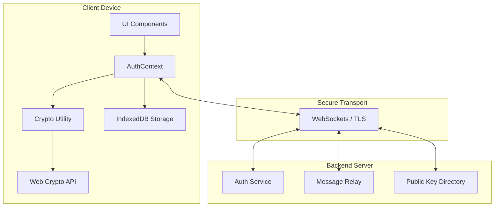

# WhisperBox - Secure E2EE Messaging

WhisperBox is a high-security messaging application built with React and the Web Crypto API. It implements true **End-to-End Encryption (E2EE)**, ensuring that your private conversations remain private, even from the server.

## 🏗 System Architecture

The application follows a client-heavy security model where all cryptographic operations occur on the local device.

## 🔐 Encryption Flow

WhisperBox uses a **Hybrid Encryption** scheme to combine the speed of symmetric encryption with the security of asymmetric key exchange.

### 1. Key Generation (At Registration)
- **RSA-OAEP (2048-bit)**: A keypair is generated locally.
- **Public Key**: Exported and stored on the server for others to find you.
- **Private Key**: Never leaves the client in plaintext. It is "wrapped" (encrypted) using a key derived from your password via **PBKDF2**.

### 2. Message Sending
1. **Fetch Recipient Public Key**: Retrieve the target user's RSA public key from the server.
2. **Generate Session Key**: Create a one-time **AES-256-GCM** key for the specific message.
3. **Encrypt Content**: Encrypt the message text using the AES key and a random IV.
4. **Key Exchange**: Encrypt the AES session key twice:
    - Once with the **Recipient's Public Key**.
    - Once with the **Sender's Public Key** (to allow the sender to read their own history).
5. **Transmit**: Send the ciphertext, IV, and the two encrypted session keys to the server.

### 3. Message Receiving
1. **Decrypt Session Key**: Use your RSA private key to decrypt the AES session key meant for you.
2. **Decrypt Content**: Use the decrypted AES key and the provided IV to recover the original plaintext.

## 🔑 Key Management

### Persistent Secure Storage
WhisperBox uses **IndexedDB** to store the encrypted session metadata locally.
- **Cached User Data**: Includes your public key and the wrapped (encrypted) private key.
- **Security**: Even if a malicious actor gains access to your local IndexedDB, they cannot read your messages because the private key is still encrypted with your account password.
- **In-Memory Logic**: The "unwrapped" private key exists only in React state and is never written to disk.

## 🛡 Security Trade-offs

| Feature | Implementation | Trade-off |
| :--- | :--- | :--- |
| **Private Key Storage** | Stored on server (encrypted) | **Convenience**: Allows multi-device sync. **Risk**: Relies on password strength (PBKDF2) to protect the key. |
| **Session Persistence** | IndexedDB caching | **Speed**: Instant app load. **Risk**: Metadata (username/display name) is visible on the local device. |
| **Key Exchange** | Static RSA-OAEP | **Stability**: Simple and reliable. **Risk**: No Perfect Forward Secrecy (PFS) if the long-term private key is compromised. |

## 🚧 Known Limitations

1. **Perfect Forward Secrecy**: The current version uses static RSA keys. A compromise of the private key would allow decryption of all past messages. (Future: Implementation of the Double Ratchet Algorithm).
2. **Device Compatibility**: Layout is optimized for desktop and tablet. Mobile responsiveness is limited.
3. **Group Chats**: Currently supports 1-to-1 messaging only.
4. **Metadata Privacy**: The server knows *who* you are talking to and *when*, though it never knows *what* you are saying.

## 🛠 Tech Stack

- **Frontend**: React 19, Vite
- **Styling**: Vanilla CSS (Custom Glassmorphism Design System)
- **Security**: Web Crypto API (SubtleCrypto)
- **Real-time**: WebSockets
- **Storage**: IndexedDB (Native API)
